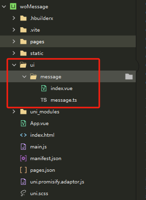

# 消息弹窗

> 采用uniapp-vue3实现, 是一款纯JS调用的消息弹窗，只支持H5，不支持小程序(小程序不支持动态插入组件元素，无法兼容)。

请下载示例项目使用，自行拷贝代码使用，不要下载插件！！！，该项目为纯JS调用，插件包无法实现自动导入

项目目录：

## 使用示例

~~~js
<template>
	<view class="content">
		<view>
			<view>
				<view style="margin-bottom: 30rpx;">简约效果</view>
				<view style="display: flex; gap: 8rpx; flex-wrap: wrap;">
					<button size="mini" @click="onPop('info', '你已完成今日打卡', false)">普通态</button>
					<button size="mini" @click="onPop('success', '恭喜预约成功', false)">成功态</button>
					<button size="mini" @click="onPop('warn', '请仔细检查内容', false)">警告态</button>
					<button size="mini" @click="onPop('error', '接口返回错误', false)">错误态</button>
				</view>
			</view>
			<view>
				<view style="margin-bottom: 30rpx;">深色效果</view>
				<view style="display: flex; gap: 8rpx; flex-wrap: wrap;">
					<button size="mini" @click="onPop('info', '你已完成今日打卡', true)">普通态</button>
					<button size="mini" @click="onPop('success', '恭喜预约成功', true)">成功态</button>
					<button size="mini" @click="onPop('warn', '请仔细检查内容', true)">警告态</button>
					<button size="mini" @click="onPop('error', '接口返回错误', true)">错误态</button>
				</view>
			</view>
		</view>
	</view>
</template>

~~~

### messageBox函数参数说明

> messageBox(status: string, info: string, duration: number,  isDeepBg: boolean)

参数：

+ status: 支持info、success、warn、error四种状态值
+ info：消息内容
+ duration：延时时间(毫秒)
+ isDeepBg: 是否启动深色背景